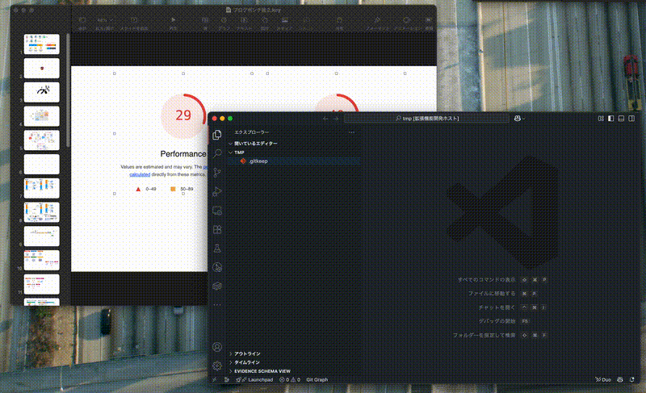

# VS Code Image Paste

English | [日本語](README_ja.md)

A Visual Studio Code extension that allows you to paste images from clipboard directly into image files being edited.



## Features

- 🖼️ **Direct Image Paste**: Paste images copied from other applications directly into open image files
- 📐 **Paste with Resize**: Specify width to resize while pasting (aspect ratio maintained automatically)
- 🔄 **Automatic Format Conversion**: Automatically converts image format based on the target file extension
- ↩️ **Undo Support**: Undo paste operations to restore the original image

## Supported Image Formats

- PNG
- JPEG / JPG
- GIF
- WebP (with some limitations)

## Development Setup

### Prerequisites

- [Node.js](https://nodejs.org/) (v16 or higher)
- [Visual Studio Code](https://code.visualstudio.com/)
- npm or yarn

### For First-time VS Code Extension Developers

1. **Clone the repository**
   ```bash
   git clone https://github.com/ideamans/vscode-image-paste.git
   cd vscode-image-paste
   ```

2. **Install dependencies**
   ```bash
   npm install
   ```

3. **Compile TypeScript**
   ```bash
   npm run compile
   ```

## Development Guide

### Running and Debugging the Extension

1. Open this project in VS Code
2. Press `F5` or run "Run Extension" from the Debug view
3. A new VS Code window will open with the extension loaded

### Debugging Tips

- Set breakpoints: Click to the left of line numbers in TypeScript files
- Console logs: View in the Debug Console
- Errors: Check the Problems panel for TypeScript errors

### Project Structure

```
vscode-image-paste/
├── src/
│   ├── extension.ts          # Main extension entry point
│   ├── services/
│   │   ├── imagePasteService.ts  # Image processing service
│   │   └── imageHistory.ts       # History management service
│   └── test/
│       └── suite/            # Test files
├── package.json              # Extension manifest
├── tsconfig.json            # TypeScript configuration
└── README.md               # This file
```

## Building and Installation

### Local Installation

1. **Package the extension**
   ```bash
   npm install -g vsce
   vsce package
   ```

2. **Install the generated .vsix file**
   - Open VS Code
   - Open Command Palette (`Ctrl+Shift+P` / `Cmd+Shift+P`)
   - Select "Extensions: Install from VSIX..."
   - Choose the generated .vsix file

## Usage

### Basic Paste

1. Open an image file (.png, .jpg, etc.) in VS Code
2. Copy an image from another application
3. Press `Ctrl+V` (Mac: `Cmd+V`) in VS Code

### Paste with Resize

1. Right-click on an open image file
2. Select "Paste Image with Resize"
3. Enter the new width when prompted (current width is displayed)
4. The image will be pasted with automatic aspect ratio maintenance

### Undo

Press `Ctrl+Z` (Mac: `Cmd+Z`) on an image file to undo the last paste operation.

## Running Tests

```bash
npm test
```

## Troubleshooting

### Cannot retrieve image from clipboard

- **macOS**: Should work out of the box
- **Windows**: Check PowerShell execution policy
- **Linux**: Ensure `xclip` is installed
  ```bash
  sudo apt-get install xclip  # Ubuntu/Debian
  ```

### Image not saving correctly

- Check file write permissions
- Ensure sufficient disk space

## Contributing

Pull requests are welcome! Please report bugs and feature requests through Issues.

## License

MIT